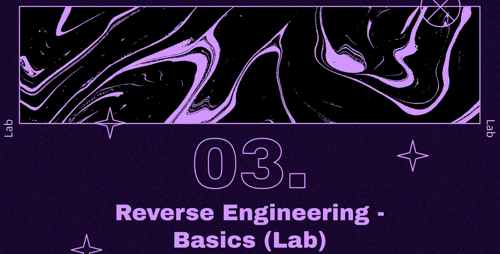
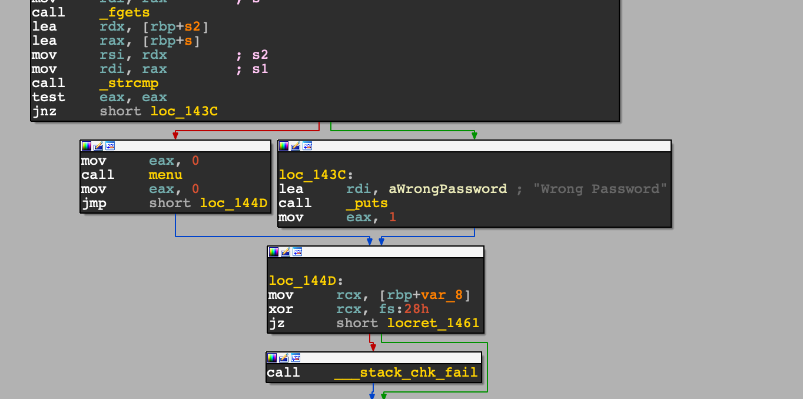
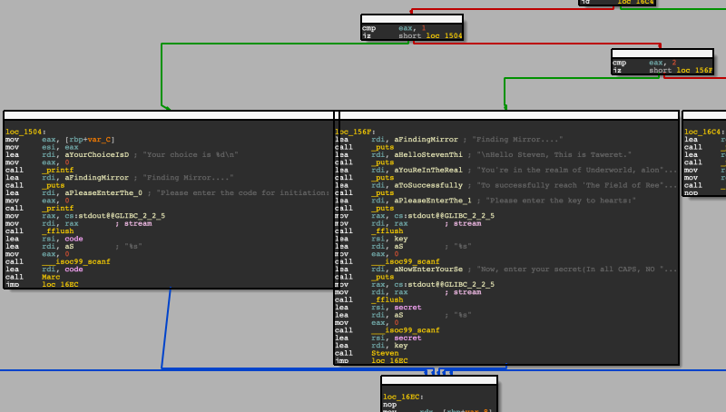

# LAB - x86-64 RE For Beginners - STANDCON 2022



## Initial setup

- Clone the gir repo
```
$ git clone https://github.com/samanL33T/x86_64_RE_For_Beginners_STANDCON_2022.git
```
 

## Stage 0 - Basic Analysis

**Goals:** To perform basic analysis of the binary and :
- Get familiar with file and strings output
- Find first flag.
-  Run the binary to get familiar with it.

### Challenge Binary Instructions
- Run _**file**_ command to check for following information about the binary
    - Binary type
    - Architecture
    - Linking
    - Stripped/Non-stripped

```
$ file KnightInit
```

Output:
```
KnightInit: ELF 64-bit LSB shared object, x86-64, version 1 (SYSV), dynamically linked, interpreter /lib64/ld-linux-x86-64.so.2, BuildID[sha1]=b9346ebe395a3df791bfb749ba2a038167af9ae7, for GNU/Linux 3.2.0, not stripped
```

- Run _**strings**_ command to find strings hardcoded in the binary.
    - Look for any sensitive information/flag.

```
$ strings KnightInit
```

Output:

```
...
...
/lib64/ld-linux-x86-64.so.2
mgUa
libc.so.6
fflush
exit
fopen
strncmp
__isoc99_scanf
puts
__stack_chk_fail
stdin
printf
mmap
fgets
strlen
stdout
memcpy
fclose
....
....
flagf
[AA]A^A_
[*] The Secrets of Khonshu.
Please enter the password to access:
Wrong Password
Welcome Avatar, please choose your personality: 
1. Marc
2. Steven
3. Jake
...
...
```


## Stage 1 - Static Analysis
**Goals:** To disassessmble the binary and:
- Familiarize yourself with assembly/ objdump output.
- Understand it's structure
- Understand the function calls etc.

### Challenge Binary Instructions

- Run objdump with following options to disassemble the binary:
```
$ objdump -d -M intel KnightInit
```

Output:
```
KnightInit:     file format elf64-x86-64


Disassembly of section .init:

0000000000001000 <_init>:
    1000:	f3 0f 1e fa          	endbr64 
    1004:	48 83 ec 08          	sub    rsp,0x8
    1008:	48 8b 05 d9 2f 00 00 	mov    rax,QWORD PTR [rip+0x2fd9]        # 3fe8 <__gmon_start__>
    100f:	48 85 c0             	test   rax,rax
    1012:	74 02                	je     1016 <_init+0x16>
    1014:	ff d0                	call   rax
    1016:	48 83 c4 08          	add    rsp,0x8
    101a:	c3                   	ret    
...
...
...

0000000000001329 <main>:
    1329:	f3 0f 1e fa          	endbr64 
    132d:	55                   	push   rbp
    132e:	48 89 e5             	mov    rbp,rsp
    1331:	48 81 ec a0 00 00 00 	sub    rsp,0xa0
    1338:	89 bd 6c ff ff ff    	mov    DWORD PTR [rbp-0x94],edi
    133e:	48 89 b5 60 ff ff ff 	mov    QWORD PTR [rbp-0xa0],rsi
    1345:	64 48 8b 04 25 28 00 	mov    rax,QWORD PTR fs:0x28
    134c:	00 00 
    134e:	48 89 45 f8          	mov    QWORD PTR [rbp-0x8],rax
    1352:	31 c0                	xor    eax,eax
    1354:	48 8b 05 f5 2d 00 00 	mov    rax,QWORD PTR [rip+0x2df5]        # 4150 <stdout@@GLIBC_2.2.5>
    135b:	48 89 c7             	mov    rdi,rax
    135e:	e8 7d fe ff ff       	call   11e0 <fflush@plt>
    1363:	48 b8 52 45 57 6f 72 	movabs rax,0x68736b726f574552
    136a:	6b 73 68 
    136d:	48 ba 6f 70 7b 66 6c 	movabs rdx,0x3167616c667b706f
...
...

```

### Points to note:

- objdump shows the top to bottom assembly instructions that program is made of.
- Disassembly of every function in the program is shown separately in the objdump output. For example, main().
- The <start> or <__libc_start_main> is usually the first function to execute that calls the main function.
- The <main> function is the first function to execute within the program. <-- Our analysis normally starts from here.
- <main> and other functions might not be recognized in disassembly if the binary is stripped. (_libc_start_main will)


## Stage 2 - Static Analysis Continued
  Quick Primer to IDA and Ghidra.
  
  **Goals:** To disassemble the binary using IDA Free and to:
  - Understand the graph and assembly view
  - Understand the control flow of the program
  - Generate pseudo code from assembly
  - Find second (or even third) flag.


### Points regarding IDA:

- The default view visible is Graph view, where the blocks are shown arranged in a graph
- Hit <space> to switch to Assembly view. This view is similar to what was seen with objdump.
- Browse through other tabs - Hex View, Imports and Exports.
- Hex View is the representation of binary in hex format.
- Imports tab lists the external modules/libraries used by the binary (if any).
- Exports tab lists the external interfaces of the binary (if any).
- The function panel on the left shows the list of functions/methods in the binary.


### Challenge Binary Instructions
Open IDA and load the binary.
- Find the main() and trace how it accepts the first flag from previous Stage.
  
- Look for menu() function being called after the first flag is verified.
  
  
- Open the disassembly/pseudo code for menu() and check how the flow that leads to each option.
  
    - Start with Option 1: Marc -> Taking some input and calling the function Marc().
    - Figure out how the input is validated and flag is revealed.

- Try the same for Option 2: Steven.


# Stage 3 - Dymanic Analysis

**Goals:**
- Familiarize with strace, ltrace and gdb
- Short gdb primer
- Look at the function calling conventions in realtime.
- Mapping the control flow from static analysis in gdb.
- Find the third and fourth flag.

### ltrace
- Run ltrace on the binary to trace library calls that the binary makes during runtime.

  ```
  $ ltrace ./KnightInit
  ```
  Output:

  ```
  pid 140324] +++ exited (status 0) +++
  ```

  You will notice that not much information is shown other than the exit status and the binary seems to run normally.
  It's because the binary is not using any external userspace libraries.
  It's only using system libraries. 
  To confirm, we can run following command:

  ```
    $ ltrace -S ./KnightInit
  ```
  Output:
  ```
  SYS_brk(0)                                                  = 0x55775ff54000
  SYS_arch_prctl(0x3001, 0x7ffdaeb4d7a0, 0x7fae561ed2c0, 0x7fae561f58b8) = -22
  SYS_access("/etc/ld.so.preload", 04)                        = -2
  SYS_openat(0xffffff9c, 0x7fae561f6b80, 0x80000, 0)          = 3
  SYS_fstat(3, 0x7ffdaeb4c9a0)                                = 0
  SYS_mmap(0, 0x18e1b, 1, 2)                                  = 0x7fae561b8000
  SYS_close(3)                                                = 0
  SYS_openat(0xffffff9c, 0x7fae56200e10, 0x80000, 0)          = 3
  SYS_read(3, "\177ELF\002\001\001\003", 832)                 = 832
  SYS_pread(3, 0x7ffdaeb4c760, 784, 64)                       = 784
  SYS_pread(3, 0x7ffdaeb4c730, 32, 848)                       = 32
  SYS_pread(3, 0x7ffdaeb4c6e0, 68, 880)                       = 68
  SYS_fstat(3, 0x7ffdaeb4c9f0)                                = 0
  SYS_mmap(0, 8192, 3, 34)                                    = 0x7fae561b6000
  SYS_pread(3, 0x7ffdaeb4c640, 784, 64)                       = 784
  SYS_pread(3, 0x7ffdaeb4c320, 32, 848)                       = 32
  SYS_pread(3, 0x7ffdaeb4c300, 68, 880)                       = 68
  SYS_mmap(0, 0x1f1660, 1, 2050)                              = 0x7fae55fc4000
  SYS_mmap(0x7fae55fe6000, 0x178000, 5, 2066)                 = 0x7fae55fe6000
  SYS_mmap(0x7fae5615e000, 0x4e000, 1, 2066)                  = 0x7fae5615e000
  SYS_mmap(0x7fae561ac000, 0x6000, 3, 2066)                   = 0x7fae561ac000
  SYS_mmap(0x7fae561b2000, 0x3660, 3, 50)                     = 0x7fae561b2000
  SYS_close(3)                                                = 0
  ```


  ### strace


  - Run strace on the binary to trace system calls that the binary makes during runtime.
  ```
    $ strace ./KnightInit
   ```
  Output:
  ```
  execve("./KnightInit", ["./KnightInit"], 0x7ffc82e22ca0 /* 62 vars */) = 0
  brk(NULL)                               = 0x55af4846e000
  arch_prctl(0x3001 /* ARCH_??? */, 0x7ffcc0b4cf30) = -1 EINVAL (Invalid argument)
  ...
  ...
  mmap(0x7fda9d23b000, 1540096, PROT_READ|PROT_EXEC, MAP_PRIVATE|MAP_FIXED|MAP_DENYWRITE, 3, 0x22000) = 0x7fda9d23b000
  mmap(0x7fda9d3b3000, 319488, PROT_READ, MAP_PRIVATE|MAP_FIXED|MAP_DENYWRITE, 3, 0x19a000) = 0x7fda9d3b3000
  mmap(0x7fda9d401000, 24576, PROT_READ|PROT_WRITE, MAP_PRIVATE|MAP_FIXED|MAP_DENYWRITE, 3, 0x1e7000) = 0x7fda9d401000
  mmap(0x7fda9d407000, 13920, PROT_READ|PROT_WRITE, MAP_PRIVATE|MAP_FIXED|MAP_ANONYMOUS, -1, 0) = 0x7fda9d407000
  close(3)                                = 0
  arch_prctl(ARCH_SET_FS, 0x7fda9d40c580) = 0
  mprotect(0x7fda9d401000, 16384, PROT_READ) = 0
  mprotect(0x55af47b6e000, 4096, PROT_READ) = 0
  mprotect(0x7fda9d453000, 4096, PROT_READ) = 0
  munmap(0x7fda9d40d000, 101915)          = 0
  fstat(1, {st_mode=S_IFCHR|0620, st_rdev=makedev(0x88, 0), ...}) = 0
  brk(NULL)                               = 0x55af4846e000
  brk(0x55af4848f000)                     = 0x55af4848f000
  write(1, "[*] The Secrets of Khonshu.\n", 28[*] The Secrets of Khonshu.
  ) = 28
  write(1, "Please enter the password to acc"..., 37Please enter the password to access:
  ) = 37
  fstat(0, {st_mode=S_IFCHR|0620, st_rdev=makedev(0x88, 0), ...}) = 0
  read(0, ^C0x55af4846e6b0, 1024) 
  ...
  ...
  ```

  ### gdb

  To be able to debug the application during runtime, we'll use GNU Debugger (gdb).

  - run the application using gdb:

  ```
    $ gdb ./KnightInit
    ```

  This will open the gdb with the binary loaded. Note that the binaryis not un running state yet.

  To run the binary we use 'r' or 'run' gdb command:

  ```gef➤ r
  gef➤ r <Command line arguments>  <-- If the binary requires command line arguments.
  ```

  The execution can be paused anytime by usint CTRL + c and resumed using 'c' or 'continue' command


  - GDB + gef/ GDB + pwndbg - Interface.

  If the gef/pwndbg plugin is used with gdb, following information is shown during every pause/step:
    - Registers in their current state.
    - Stack
    - Disassembly of the binary
    - Threads (if any)
    - Execution trace

  Example:

  ```
  $rax   : 0xfffffffffffffe00
  $rbx   : 0x00007ffff7fa8980  →  0x00000000fbad2288
  $rcx   : 0x00007ffff7eca002  →  0x5677fffff0003d48 ("H="?)
  $rdx   : 0x400             
  $rsp   : 0x00007fffffffdae8  →  0x00007ffff7e4cbcf  →  <_IO_file_underflow+383> test rax, rax
  $rbp   : 0x00007ffff7fa54a0  →  0x0000000000000000
  $rsi   : 0x00005555555596b0  →  0x0000000000000000
  $rdi   : 0x0               
  $rip   : 0x00007ffff7eca002  →  0x5677fffff0003d48 ("H="?)
  $r8    : 0x0               
  $r9    : 0x7c              
  $r10   : 0x00007ffff7fa8be0  →  0x0000555555559ab0  →  0x0000000000000000
  $r11   : 0x246             
  $r12   : 0x00007ffff7fa96a0  →  0x00000000fbad2a84
  $r13   : 0x00007ffff7fa48a0  →  0x0000000000000000
  $r14   : 0xd68             
  $r15   : 0x00007ffff7fa5608  →  0x0000000000000000
  $eflags: [ZERO carry PARITY adjust sign trap INTERRUPT direction overflow resume virtualx86 identification]
  $cs: 0x0033 $ss: 0x002b $ds: 0x0000 $es: 0x0000 $fs: 0x0000 $gs: 0x0000 
  ─────────────────────────────────────────────────────────────────────────────────────── stack ────
  0x00007fffffffdae8│+0x0000: 0x00007ffff7e4cbcf  →  <_IO_file_underflow+383> test rax, rax        ← $rsp
  0x00007fffffffdaf0│+0x0008: 0x0000000000000000
  0x00007fffffffdaf8│+0x0010: 0x00007ffff7fa54a0  →  0x0000000000000000
  0x00007fffffffdb20│+0x0038: 0x0000000000000000
  ───────────────────────────────────────────────────────────────────────────────── code:x86:64 ────
     0x7ffff7eca000 <read+16>        syscall 
   → 0x7ffff7eca002 <read+18>        cmp    rax, 0xfffffffffffff000
     0x7ffff7eca008 <read+24>        ja     0x7ffff7eca060 <__GI___libc_read+112>
     0x7ffff7eca00a <read+26>        ret    
  ───────────────────────────────────────────────────────────────────────────────────── threads ────
  [#0] Id 1, Name: "KnightInit", stopped 0x7ffff7eca002 in __GI___libc_read (), reason: SIGINT
  ─────────────────────────────────────────────────────────────────────────────────────── trace ────
  [#0] 0x7ffff7eca002 → __GI___libc_read(fd=0x0, buf=0x5555555596b0, nbytes=0x400)
  [#1] 0x7ffff7e4cbcf → _IO_new_file_underflow(fp=0x7ffff7fa8980 <_IO_2_1_stdin_>)
  [#2] 0x7ffff7e4dfb6 → __GI__IO_default_uflow(fp=0x7ffff7fa8980 <_IO_2_1_stdin_>)
  [#3] 0x7ffff7e3f89c → __GI__IO_getline_info(fp=0x7ffff7fa8980 <_IO_2_1_stdin_>, buf=0x7fffffff
  ```

  The same information can also be viewed individually using following commands:
  - 'ir' or 'inf registers'  -> To View the registers
  - 'info stack' to view the stack.
  - 'disass <function name or address>' -> To show the disassembly of particular function.
  - 'x/10i' $rip -> TO show disasembly of next 10 instructions from current instruction pointer.

  ```
  gef➤  x/10 $rip
  0x555555555329 <main>:  0xfa1e0ff3      0xe5894855      0xa0ec8148      0x89000000
  0x555555555339 <main+16>:       0xffff6cbd      0xb58948ff      0xffffff60      0x48b4864
  0x555555555349 <main+32>:       0x2825  0x45894800
  ```

  - Stepping the execution flow.

  We can move with the program execution using following commands:
    - 'si' or 'step into' -> Step one instruction at a time.
    - 'ni' or 'next instruction' -> Step one instruction at a time, but will step over any subroutines.
    - 'finish' -> Runs until the current stack frame returns/finish the execution of current subroutine and then breaks.
    - 'c' or 'continue -> Continue the program execution.


  - Breakpoints
  We can play with breakpoints using following commands:
      - 'b <function name>' or 'b *<address>' -> Sets a breakpoint at the start of a function or at a particular address.
      - 'info breakpoints' -> Lists the current breakpounts.
      - 'enable <breakpoint number>' / 'disable <breakpoint number>' -> Enable or disable breakpoints.

  ```
  gef➤  info breakpoints 
  Num     Type           Disp Enb Address            What
  1       breakpoint     keep y   0x0000555555555329 <main>
          breakpoint already hit 1 time
  gef➤  disable 1
  gef➤  info breakpoints 
  Num     Type           Disp Enb Address            What
  1       breakpoint     keep n   0x0000555555555329 <main>
          breakpoint already hit 1 time
  gef➤  enable 1
  ```

  ### Challenge Binary Instructions:

  - Run the binary using gdb and disassemble the function menu().
  - Set breakpoint on the call to function Steven()
  ```
  gef➤  break *menu+432
  Breakpoint 2 at 0x555555555613
  ```

  - Notice the arguments to Steven() function passed in rdi and rsi.
  ```
  rax   : 0x1               
  $rbx   : 0x0000555555555c50  →  <__libc_csu_init+0> endbr64 
  $rcx   : 0x0               
  $rdx   : 0x0               
  $rsp   : 0x00007fffffffdbd0  →  0x00000002ffffdc90
  $rbp   : 0x00007fffffffdbe0  →  0x00007fffffffdc90  →  0x0000000000000000
  $rsi   : 0x0000555555558178  →  "STEVENISMARC"
  $rdi   : 0x0000555555558170  →  0x000000000000004d ("M"?)
  $rip   : 0x0000555555555613  →  <menu+432> call 0x5555555557fe <Steven>
  ```

  - Step into ('si') and compare the flow with the Control Flow graph in IDA.
      - Keep note of any CMP instructions and see where ti fails with regards to your input.
  
  - Let's figure out how input is processed and find the flag. (Practical)
