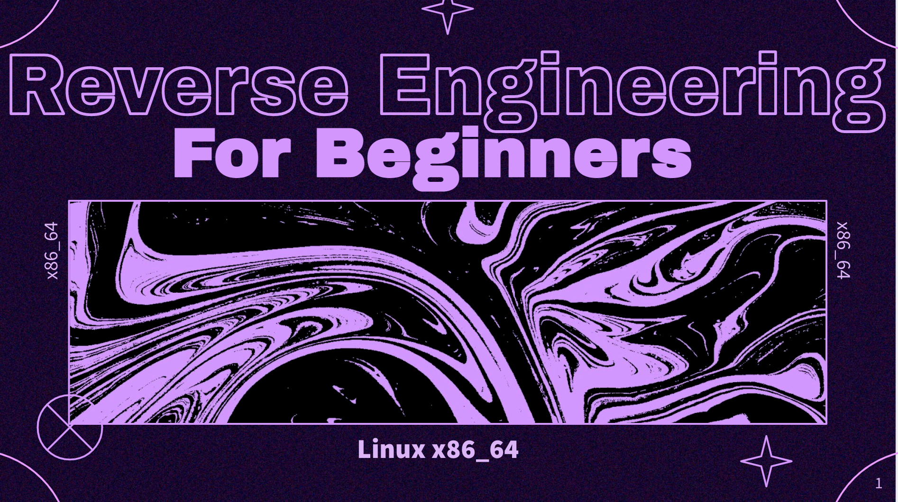

# STANDCON 2022 - Workshop on 'Linux x86_64 Reverse Engineering for Beginners'

Contents as well as practice binary for the workshop hosted on 'Linux x86_64 Reverse Engineering for Beginners' during STANDCON 2022.

- **Linux_x86_64_RE_for_Beginners_STANDCON_v1.0.pdf** - workshop slides

- **Lab_Worksheet** - Lab Worksheet

- **CTF_Binary** - Contains the challenge binary used for analysis and CTF
