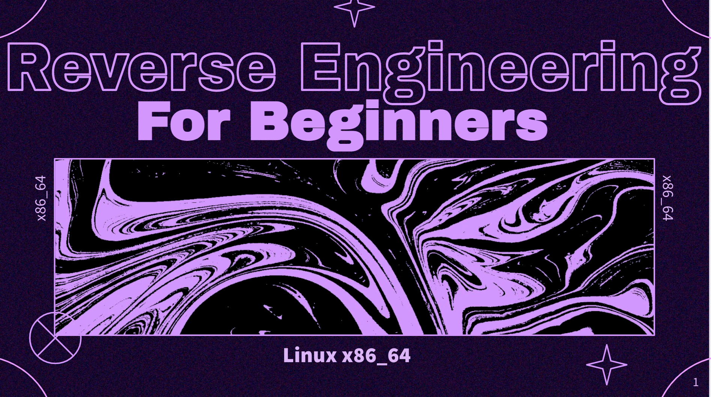

# STANDCON 2022 - Workshop on 'Linux x86_64 Reverse Engineering for Beginners'

Contents as well as practice binary for the workshop hosted on 'Linux x86_64 Reverse Engineering for Beginners' during STANDCON 2022.

**- Slides:** Contains the workshop slides

**- Lab Worksheet:** Contains the worksheet used for labs

**- CTF:** Contains the challenge binary used for analysis and CTF
